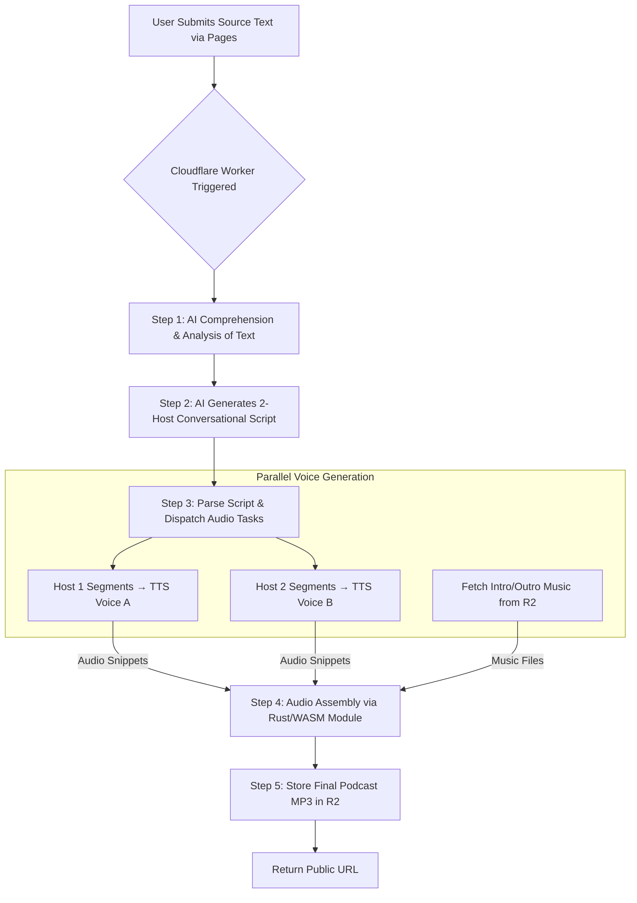

# The AI Roundtable Agent

An advanced, AI-powered application that transforms any source text into a conversational podcast. This project was built entirely on the Cloudflare developer platform for the 2025 Software Engineering Internship application.

**Core Technologies:** `Cloudflare Workers` `Workers AI` `Rust / WASM` `Cloudflare R2` `Cloudflare Workflows`

---

## Vision & Summary

The **AI Roundtable Agent** is a content-generation engine that acts as an instant podcast production team. The agent takes any piece of source text—such as an article, a report, or a memo—and produces a fully-produced, conversational audio file.

Instead of simply reading the text aloud, the agent first comprehends the source material to extract its key themes and arguments. It then generates a **completely original and new script** depicting a natural, back-and-forth dialogue between distinct AI hosts. These hosts discuss and debate the ideas from the source text, creating an engaging and insightful conversation.

This final audio is complete with two different host voices and intro/outro music, demonstrating an end-to-end, serverless pipeline for creative AI work.

## Key Features

* **AI-Powered Conversational Scriptwriting:** The agent deeply analyzes source text and writes a brand new, two-host dialogue about its core concepts.
* **Dual-Host Audio Generation:** Utilizes two distinct Text-to-Speech voices from Workers AI to produce a dynamic, conversational podcast.
* **High-Performance Audio Assembly:** Employs a custom **Rust/WASM** module for the efficient, serverless concatenation of audio files on the Cloudflare network.
* **End-to-End Serverless:** The entire application, from the user interface to the complex AI pipeline, is built and deployed on Cloudflare.

---
## Technical Architecture & Data Pipeline

The entire process is orchestrated by a serverless workflow that manages a sophisticated chain of AI reasoning and multimedia processing.

### Pipeline Steps Explained:

1.  **User Input:** The process is initiated when a user submits their source text through a minimalist frontend hosted on **Cloudflare Pages**.

2.  **AI Script Generation:** This is the creative core of the agent. The **Cloudflare Worker** first sends the source text to a **Workers AI** LLM for comprehension and analysis. Then, using that analysis for context, it prompts the LLM a second time with a sophisticated request to write a completely new, conversational script between two distinct AI host personas.

3.  **Parallel Voice Generation:** The Worker parses the AI-generated script. To maximize efficiency, all dialogue segments are dispatched in parallel to the **Workers AI** Text-to-Speech (TTS) model. `Host 1`'s lines are assigned one voice, and `Host 2`'s lines are assigned another. Concurrently, the intro and outro music files are fetched from **R2**.

4.  **Audio Assembly:** This critical step is handled by a custom, high-performance **Rust/WASM** module running inside the Worker. This module receives all the generated audio snippets and music files and stitches them together in the correct sequence into a single, cohesive audio file. Using Rust/WASM allows for fast, reliable processing of audio data directly on the edge.

5.  **Final Output:** The completed MP3 file is uploaded to an **R2** bucket. A public URL to this file is returned to the user, allowing them to listen to or download their podcast.

---
## Technology Stack

* **Compute:** Cloudflare Workers
* **AI:** Cloudflare Workers AI (LLM for reasoning, TTS for audio)
* **Storage:** Cloudflare R2 (for audio assets and final output)
* **Orchestration:** Cloudflare Workflows
* **Frontend:** Cloudflare Pages
* **Backend Language:** TypeScript
* **Audio Module:** Rust compiled to WebAssembly (WASM)
* **Tooling:** Wrangler CLI
