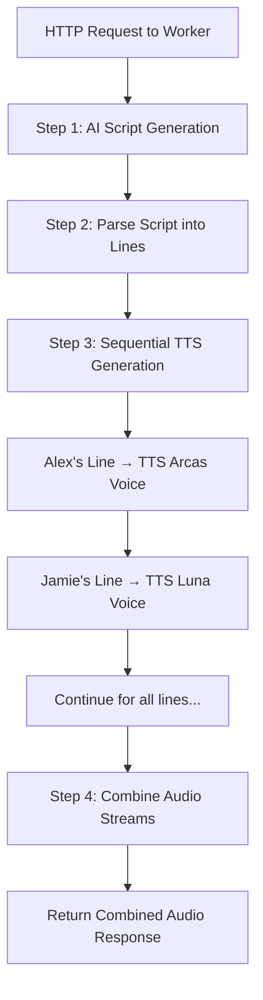

# The AI Roundtable Agent

An AI-powered application that transforms any topic into a conversational podcast. This project is being built entirely on the Cloudflare developer platform for the 2025 Software Engineering Internship application.

**Core Technologies:** `Cloudflare Workers` `Workers AI` `TypeScript` `Cloudflare Pages (planned)`

---

## Vision & Summary

The **AI Roundtable Agent** is a content-generation engine that acts as an instant podcast production team. The agent takes any topic or source text—such as an article, a report, or a memo—and produces a conversational audio file featuring two distinct AI hosts.

Instead of simply reading the text aloud, the agent generates a **completely original script** depicting a natural, back-and-forth dialogue between distinct AI hosts (Alex and Jamie). These hosts discuss and debate the ideas from the source material, creating an engaging and insightful conversation.

This project demonstrates serverless AI orchestration, combining large language models with text-to-speech synthesis on Cloudflare's edge network.

## Current Features (Implemented)

* **AI-Powered Conversational Scriptwriting:** Uses Workers AI (GPT-based LLM) to generate a two-host dialogue script with distinct personalities
* **Dual-Host Audio Generation:** Utilizes two distinct Text-to-Speech voices from Workers AI (Deepgram Aura-1) to produce a dynamic conversation
  - Alex: Knowledgeable and calm presenter (Arcas voice)
  - Jamie: Inquisitive and upbeat co-host (Luna voice)
* **Sequential Audio Assembly:** Combines multiple TTS audio streams into a single continuous podcast file
* **Serverless Execution:** Runs entirely on Cloudflare Workers with no external dependencies

---
## Technical Architecture & Data Pipeline

### Current Implementation



### Current Pipeline Steps:

1.  **Worker Invocation:** The Cloudflare Worker receives an HTTP request (currently hardcoded topic: "Cloudflare as a company")

2.  **AI Script Generation:** The Worker sends a prompt to **Workers AI** (`@cf/openai/gpt-oss-120b`) to generate a conversational script between two hosts (Alex and Jamie). The prompt specifies personality traits, format requirements, and ensures proper opening/closing segments.

3.  **Script Parsing:** The generated script is parsed line-by-line, extracting dialogue for each host based on `[Alex]:` and `[Jamie]:` markers.

4.  **Sequential TTS Generation:** For each line, the Worker calls **Workers AI** TTS (`@cf/deepgram/aura-1`) with the appropriate voice:
   - Alex's lines use the "arcas" voice
   - Jamie's lines use the "luna" voice

5.  **Audio Stream Combination:** All generated audio streams are sequentially combined using a custom JavaScript function that reads each stream and enqueues chunks into a final output stream.

6.  **Response:** The combined audio stream is returned directly as the HTTP response.

---
## Technology Stack

### Currently Implemented
* **Compute:** Cloudflare Workers
* **AI Models:** 
  - Cloudflare Workers AI - `@cf/openai/gpt-oss-120b` (script generation)
  - Cloudflare Workers AI - `@cf/deepgram/aura-1` (text-to-speech)
* **Backend Language:** TypeScript
* **Tooling:** Wrangler CLI, Vitest (testing)

### Planned Enhancements
* **Frontend:** Cloudflare Pages with text input form
* **Storage:** Cloudflare R2 (for storing generated podcasts and audio assets)
* **Orchestration:** Cloudflare Workflows for complex pipeline management
* **Features:** Intro/outro music, parallel TTS generation, custom topics via UI, podcast history

---

## Roadmap & Next Steps

### Phase 1: Core Functionality ✅ (Current)
- [x] AI script generation with dual-host personalities
- [x] Text-to-speech synthesis with distinct voices
- [x] Basic audio stream concatenation
- [x] Serverless deployment on Cloudflare Workers

### Phase 2: User Interface (Next Priority) 🎯
- [ ] Build Cloudflare Pages frontend with clean, modern design
- [ ] Text input form for custom topics/source text
- [ ] Real-time generation status updates
- [ ] Audio player with playback controls
- [ ] Download button for generated podcasts
- [ ] Display generated script alongside audio

### Phase 3: Storage & Persistence
- [ ] Integrate Cloudflare R2 for podcast storage
- [ ] Generate unique URLs for each podcast
- [ ] Store podcasts with metadata (topic, date, duration)
- [ ] Implement podcast history/library view
- [ ] Add sharing capabilities (copy link, social media)

### Phase 4: Production Features & Polish
- [ ] Add intro/outro music from R2 storage
- [ ] Implement parallel TTS generation for faster processing
- [ ] Cloudflare Workflows for complex orchestration
- [ ] Caching layer for frequently requested topics
- [ ] Rate limiting and usage analytics
- [ ] Support for longer source texts (chunking)
- [ ] Multiple podcast length options (short/medium/long)
- [ ] Error handling and user feedback
- [ ] Loading states and progress indicators

---

## Development

### Prerequisites
- Node.js (v18+)
- Wrangler CLI
- Cloudflare account with Workers AI enabled

### Local Development
```bash
cd aipodcast-worker
npm install
npm run dev
```

### Deployment
```bash
npm run deploy
```

### Testing
```bash
npm test
```

---

## Project Structure
```
cf_ai_aipodcast/
├── aipodcast-worker/          # Cloudflare Worker application
│   ├── src/
│   │   └── index.ts           # Main worker logic
│   ├── test/                  # Test files
│   ├── wrangler.toml          # Worker configuration
│   └── package.json
├── pages/                     # Cloudflare Pages frontend (planned)
│   └── index.html             # User interface
├── README.md
├── TODO                       # Development checklist
└── prompts.md                 # AI prompt engineering notes
```

---

## Current Limitations & Known Issues

- **Hardcoded Topic:** Currently generates podcasts only about "Cloudflare as a company"
- **No Persistence:** Generated audio is returned directly without storage
- **Sequential Processing:** TTS generation happens one line at a time (slower)
- **No UI:** Must interact directly with Worker endpoint
- **Fixed Length:** Generates exactly 12 lines per host (24 total)

These limitations will be addressed in upcoming phases!

---

## Contributing

This project is part of a Cloudflare internship application. Feedback and suggestions are welcome!

---

## License

This project is for educational and demonstration purposes.
